!SLIDE
# What is Git?

!SLIDE center

# DVCS

### Distributed Version Control System

!SLIDE 

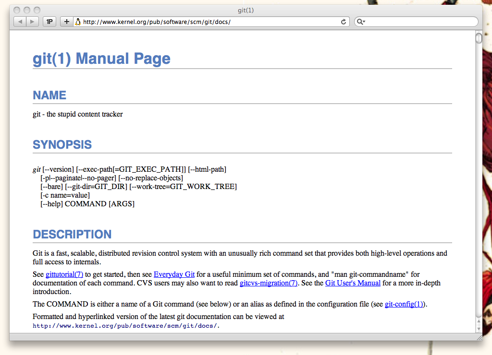

!SLIDE
# Git is a NOSQL DB?

!SLIDE
# Git is a <del>NOSQL</del> DB?

!SLIDE
# Git is a key/value store.

!SLIDE commandline
# Writing Objects

    $ echo '{"data":[1,2,3]}' | git hash-object -w --stdin
    bb12da17bca409723fd745c9afc209662bcbd4d9

!SLIDE commandline
# Reading Objects

    $ ls .git/objects/*
    .git/objects/bb:
    12da17bca409723fd745c9afc209662bcbd4d9

    $ git cat-file -p bb12da17bca409723fd745c9afc209662bcbd4d9
    {"data":[1,2,3]}

!SLIDE center

!SLIDE
# Git is a graph database.

!SLIDE commandline
# Trees

    $ git update-index --add --cacheinfo 100644 \
      1f7a7a472abf3dd9643fd615f6da379c4acb3e3a my-key.json

    $ git write-tree
    d8329fc1cc938780ffdd9f94e0d364e0ea74f579

!SLIDE center
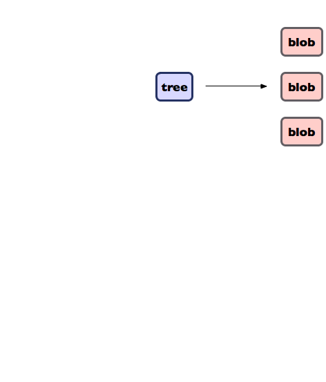

!SLIDE commandline
# Commits

    $ echo 'storing some json' | git commit-tree d8329f
    fdf4fc3344e67ab068f836878b6c4951e3b15f3d

!SLIDE center
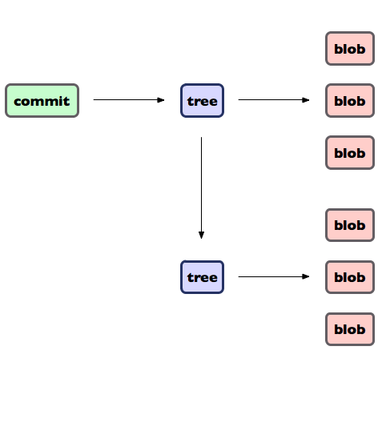

!SLIDE commandline
# Refs

    $ git checkout -b my-new-branch

    $ cat .git/refs/heads/master
    74d193238c5141f1bbf28541457137a82bc95edf

    $ cat .git/refs/heads/my-new-branch
    74d193238c5141f1bbf28541457137a82bc95edf

!SLIDE center
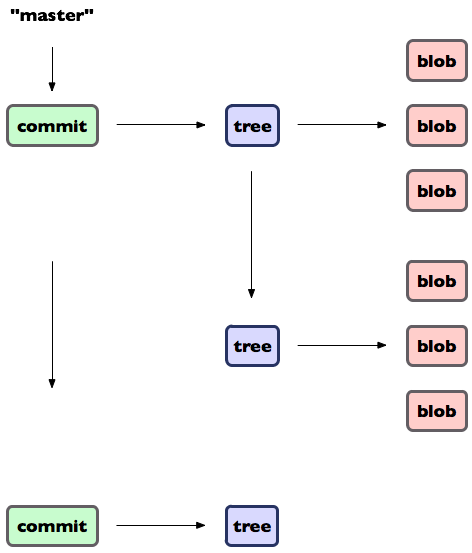

!SLIDE commandline
# Tags

    $ git tag v1.0

    $ cat .git/refs/tags/v1.0
    74d193238c5141f1bbf28541457137a82bc95edf

!SLIDE center
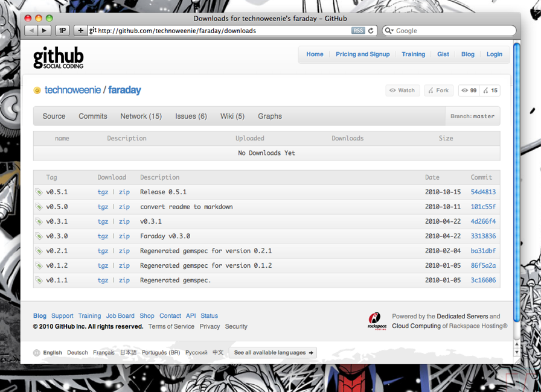

!SLIDE commandline
# Annotated Tags

    $ git tag -a v1.0 -m "Version 1.0"
    # Stores Tagger / Tagged Date
    # Stores Message

!SLIDE center
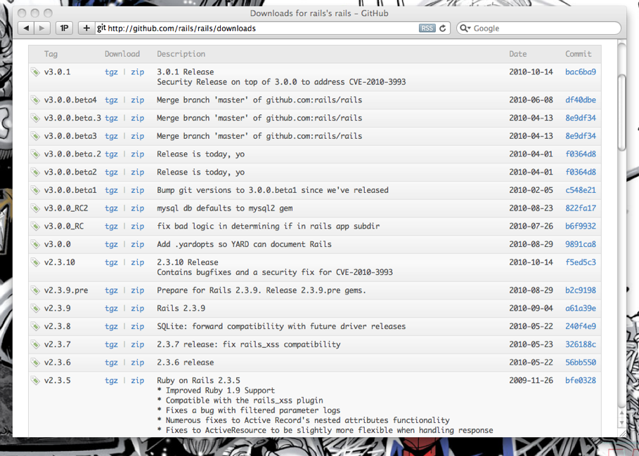

!SLIDE center

!SLIDE
# [Grit](http://github.com/mojombo/grit)

    @@@ ruby
    require 'grit'
    repo = Grit::Repo.new("/Users/tom/dev/grit")
    repo.commits
    # => [#<Grit::Commit "e80bbd2ce67651aa18e57fb0b43618ad4baf7750">,
          #<Grit::Commit "91169e1f5fa4de2eaea3f176461f5dc784796769">,
          #<Grit::Commit "038af8c329ef7c1bae4568b98bd5c58510465493">,
          #<Grit::Commit "40d3057d09a7a4d61059bca9dca5ae698de58cbe">,
          #<Grit::Commit "4ea50f4754937bf19461af58ce3b3d24c77311d9">]

!SLIDE
# [GitModel](https://github.com/pauldowman/gitmodel)

    @@@ ruby
    GitModel.db_root = '/tmp/gitmodel-data'
    GitModel.create_db!

    class Post
      include GitModel::Persistable

      attribute :title
      attribute :body
      attribute :categories, :default => []
      attribute :allow_comments, :default => true

      blob :image
    end

!SLIDE
# GitModel

    @@@ ruby
    p = Post.new(:id => 'hotdog-eating-contest', :title => 'I won!')
    p.body = 'This weekend I won a hotdog eating contest!'
    p.image = some_binary_data
    p.blobs['hotdogs.jpg'] = some_binary_data
    p.blobs['the-aftermath.jpg'] = some_binary_data
    p.save!

!SLIDE center
# Ribbit

[libgit2](http://github.com/libgit2/libgit2) /
[ribbit](http://github.com/libgit2/ribbit)

!SLIDE
# ALL HAIL RIBBIT

    @@@ ruby
    repo   = Ribbit::Repository.new("/Users/tom/dev/grit")
    walker = Ribbit::Walker.new(repo)
    walker.push("e80bbd2ce67651aa18e57fb0b43618ad4baf7750")
    walker.hide("4ea50f4754937bf19461af58ce3b3d24c77311d9")
    while commit = walker.next
      puts commit.sha
    end

!SLIDE center 
# Wheat

!SLIDE commandline incremental
# Tracked Revisions

    $ git log -- articles/object-graphs-3.markdown
    commit dbef73b7a16df4ad5f9473e3eaf66e52d4c35f71
    Author: Tim Caswell <tim@creationix.com>
    Date:   Tue Nov 9 10:01:19 2010 -0800

        Update the headers.

    commit 9bf2f0e1c16ce0c32f79f2fde7e683dee41dec24
    Author: Tim Caswell <tim@creationix.com>
    Date:   Tue Nov 9 09:59:03 2010 -0800

        Add part three of the object series article.

!SLIDE commandline incremental
# Attached Code Samples

    $ git ls-tree master articles/object-graphs-3/
    100644 blob 1972c9b articles/object-graphs-3/Class.js
    100644 blob ab10772 articles/object-graphs-3/Enumerable.js
    100644 blob 8907d13 articles/object-graphs-3/animal.js
    100644 blob 09b09bb articles/object-graphs-3/animal.js.dot
    100644 blob 7cfac5c articles/object-graphs-3/animal.js.simple.dot
    100644 blob 83647ea articles/object-graphs-3/animal.rb
    100644 blob f5cb2e3 articles/object-graphs-3/animal.rb.dot
    100644 blob f840ffe articles/object-graphs-3/animal.rb.simple.dot
    100644 blob e69de29 articles/object-graphs-3/class.rb
    100644 blob 7d6734d articles/object-graphs-3/dave.js
    100644 blob b0e032d articles/object-graphs-3/dave.js.dot
    100644 blob 9c4d8dd articles/object-graphs-3/dave.rb
    100644 blob bae6591 articles/object-graphs-3/dave.rb.dot
    100644 blob 4d9d439 articles/object-graphs-3/dave2.js
    100644 blob 4ee986c articles/object-graphs-3/dave2.js.dot
    100644 blob 942f2a2 articles/object-graphs-3/dave2.rb
    100644 blob d36b002 articles/object-graphs-3/dave2.rb.dot
    100644 blob a3b64fc articles/object-graphs-3/singleton.js
    100644 blob 7d23adc articles/object-graphs-3/singleton.js.dot
    100644 blob 173ffc7 articles/object-graphs-3/singleton.rb
    100644 blob ea556f8 articles/object-graphs-3/singleton.rb.dot
    100644 blob 336910b articles/object-graphs-3/test.js

!SLIDE center
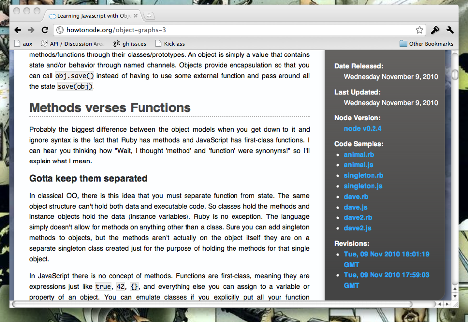

!SLIDE
# Social Git Use

## "The content for this site is stored in a **git** repository that anyone can fork, write an article, and **send a pull request**. If your article passes the quality standards it will be published and help support the greater node community."

!SLIDE center commandline
# [Gollum](http://github.com/github/gollum)

    $ gem install grit
    $ gem install gollum

!SLIDE commandline
# Lightweight

    $ cd faraday.wiki
    $ gollum
    == Sinatra/1.0 has taken the stage on 4567 for development with backup from Thin
    >> Thin web server (v1.2.7 codename No Hup)
    >> Maximum connections set to 1024
    >> Listening on 0.0.0.0:4567, CTRL+C to stop

!SLIDE center

!SLIDE
# History of Changes

    @@@ ruby
    class Gollum::Page
      def versions(options = {})
        # @path = "docs/home.md"
        # git log master -- docs/home.md
        @wiki.repo.log('master', @path)
      end
    end

!SLIDE center
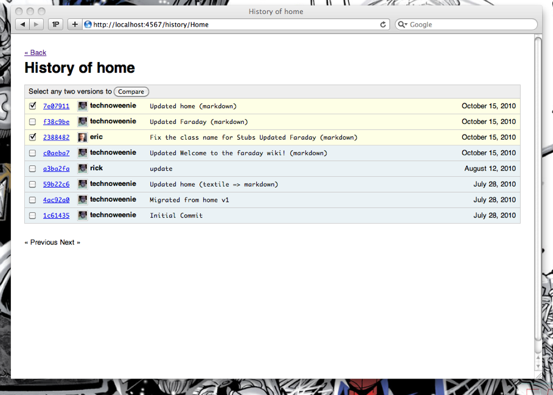

!SLIDE
# Diffs

    @@@ ruby
    class Gollum::Page
      def diff(start, finish)
        # @path = "docs/home.md"
        # git diff sha1 sha2 -- docs/home.md
        @wiki.repo.diff(start, finish, @path)
      end
    end

!SLIDE center
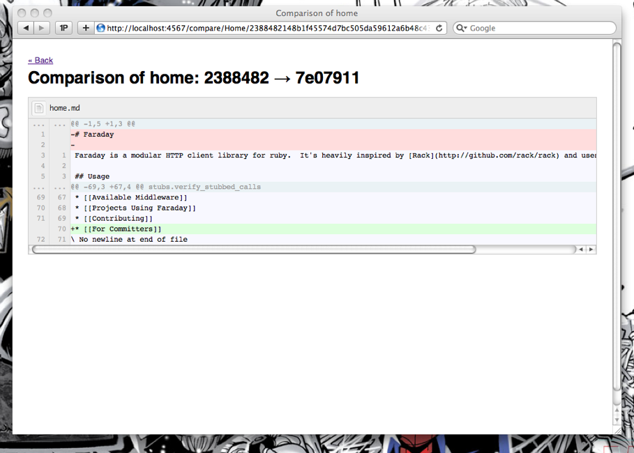

!SLIDE 
# Search With Grep
    @@@ ruby
    class Gollum::Wiki
      def search(query)
        # $ git grep -c FooController
        # app/controller/foo_controller.rb:1
        # test/functional/foo_controller_test.rb:1
        @repo.git.grep({:c => query}, 'master')
      end
    end

!SLIDE bullets
# Git Hooks

* Update caches
* Publish alternative formats (PDF, ATOM, JSON)
* Full-text indexing

!SLIDE bullets
# Git Challenges in Gollum

* Git/Grit limitations
* Scaling for GitHub.com

!SLIDE commandline incremental
# Latest Updates

    $ git diff-tree --name-only master~10 master
    Available-middleware.md
    For-committers.md
    Projects-using-faraday.md

    $ git diff-tree --name-only master~30 master
    fatal: ambiguous argument 'master~30': unknown revision or path not in the working tree.
    Use '--' to separate paths from revisions

!SLIDE
# GitRuby vs Native Git

    @@@ ruby
    puts grit.ls_tree(
      {:l => true, :r => true}, 'master')
    # 100644 blob SHA home.md
    # 100644 blob SHA images/send-pull-req.png

    # git ls-tree master -r -l
    puts grit.native(:ls_tree, 
      {:l => true, :r => true}, 'master')
    # 100644 blob SHA  2305 home.md
    # 100644 blob SHA 60638 images/send-pull-req.png

!SLIDE center
# A "big" Gollum Wiki
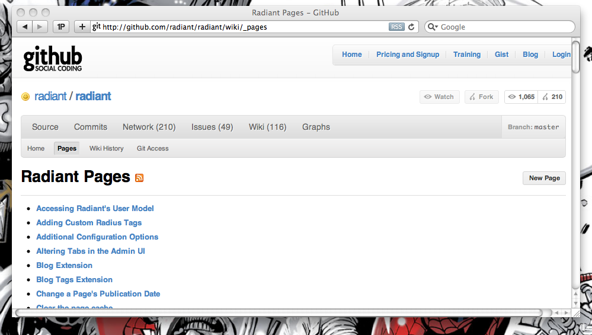

!SLIDE center
# Gollum Wikis Won't Scale

!SLIDE
# Concurrent Git Commits

## fatal: Unable to create '.git/index.lock': File exists.

## If no other git process is currently running, this probably means a git process crashed in this repository earlier. Make sure no other git process is running and remove the file manually to continue.

!SLIDE
# Concurrent Git Commits

    @@@ ruby
    # possible race condition!
    grit.index.commit(message, 
      :parents => [SHA1], :head => "master")

!SLIDE center
# Commit SHAs =~ Vector Clocks

!SLIDE center
# Git only _detects_ conflicts

!SLIDE center
# Git requires manual merges

!SLIDE center
# Get Git a Wingman!

!SLIDE center
# Smoke is Grit in the Cloud
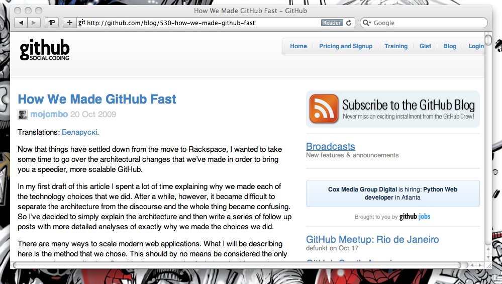

!SLIDE bullets
# Smoke is Grit in the Cloud

* Redis maps repos to file servers
* Smoke proxies to file servers
* Git is now a remote database

!SLIDE
# Local != Remote

    @@@ ruby
    sha     = @repo.git.rev_parse(
      {:verify => true}, 'master')
    commit  = @repo.commit(sha)
    tree    = commit.tree
    subtree = tree / 'lib'
    blob    = subtree / 'gollum.rb'
    puts blob.data

!SLIDE 
# Use Simple APIs

    @@@ ruby
    module Gollum
      class GitAccess
        # Public method for getting a tree by ref or sha
        def tree(ref)
          sha = ref_to_sha(ref)
          get_cache(:tree, sha) { tree!(sha) }
        end

        def tree!(sha)
          @repo.tree(sha)
        end
!SLIDE 
# Use Simple APIs

    @@@ ruby
    module Gollum
      class GitAccess

        def tree(ref)
          sha = ref_to_sha(ref)
          get_cache(:tree, sha) { tree!(sha) }
        end
        # Private method for accessing data through Grit
        def tree!(sha)
          @repo.tree(sha)
        end

!SLIDE
# Memcache/Redis for caching

    @@@ ruby
    class Walker
      def tree(sha)
        cache("tree:#{net_id}:#{sha}") do
          raw_tree(sha)
        end
      end
    end

!SLIDE
# Redis for custom sorting

    @@@ ruby
    class GitHub::Gollum::Wiki
      def update_page_recency(name, commit)
        @redis.zadd("wiki:#{repo_id}:updated", 
          commit.committed_date.to_i, 
          name)
      end
    end

!SLIDE commandline incremental
# Redis for custom sorting

    $ redis-cli zrange wiki:1:updated 0 2
    1. contributors.md
    2. help.md
    3. home.md

    $ redis-cli zscore wiki:1:updated
    1280171806

!SLIDE bullets

# Other Possible Wingmen

* Riak (clustered key/value, simple links, search)
* CouchDB (similar replication, versioning)
* VertexDB (graph databases)

!SLIDE center

# BONUS ROUND: Madrox

[http://github.com/technoweenie/madrox](http://github.com/technoweenie/madrox)

!SLIDE commandline
# Get Madrox

    $ git clone http://github.com/technoweenie/madrox.git

!SLIDE commandline
# Setup Madrox repo

    $ mkdir madrox-sample
    $ cd madrox-sample
    $ git init
    $ touch README
    $ git add README
    $ git commit -m "initial"
    [master (root-commit) b2bfffe] initial
     0 files changed, 0 insertions(+), 0 deletions(-)
     create mode 100644 README

!SLIDE
# First Tweet

    @@@ ruby 
    repo = Madrox::Repo.new "/path/to/repo"
    timeline = repo.timeline('technoweenie', 'rick@email.com')
    tineline.post("Hi")

!SLIDE
# Retweeting

    @@@ ruby
    repo = Madrox::Repo.new "/path/to/repo"
    friend   = repo.timeline("schacon")
    timeline = repo.timeline('technoweenie', 'rick@email.com')
    tweet    = friend.messages.first
    # timeline.post(tweet.message, 
    #   :author => tweet.author)
    timeline.retweet(tweet)

!SLIDE
# Favorites

    @@@ ruby
    repo = Madrox::Repo.new "/path/to/repo"
    friend   = repo.timeline("schacon")
    timeline = repo.timeline('technoweenie', 'rick@email.com')
    tweet    = friend.messages.first
    # timeline.post(tweet.message, 
    #   :head   => "technoweenie-favorites",
    #   :author => tweet.author)
    timeline.fave(tweet)

!SLIDE
# Showing Messages: Madrox

    @@@ ruby
    repo = Madrox::Repo.new "/path/to/repo"
    timeline = repo.timeline('technoweenie', 'rick@email.com')
    timeline.messages.each do |commit|
      puts commit.message
    end

!SLIDE commandline
# Showing Messages: Git

    $ git log technoweenie
    commit e5a5950c7ff743a636015f1419260f4e9490aef2
    Author: technoweenie <rick@github.com>
    Date:   Tue Oct 19 23:50:05 2010 -0700

        @atmos: nada

    commit 52c3d2dfd81e918d491d5c9895fca33a91427387
    Author: technoweenie <rick@github.com>
    Date:   Tue Oct 19 23:47:34 2010 -0700

        Hi

    commit b2bfffe5bc9254f2bcaf464e164dd20f858d55a4
    Author: rick <technoweenie@gmail.com>
    Date:   Wed Oct 20 08:47:05 2010 +0200

        initial

!SLIDE commandline
# Merging Timelines

    $ git checkout -b timeline

    $ git merge technoweenie
    Updating b2bfffe..e5a5950
    Fast-forward
     0 files changed, 0 insertions(+), 0 deletions(-)
     delete mode 100644 README

    $ git merge atmos
    Merge made by recursive.

!SLIDE commandline
# Timeline in Madrox

    $ ../madrox/bin/madrox timeline
    [Wed Oct 20 08:50:05 +0200 2010] @technoweenie: @atmos: nada
    [Wed Oct 20 08:49:13 +0200 2010] @atmos: @technoweenie: sup?
    [Wed Oct 20 08:47:34 +0200 2010] @technoweenie: Hi

!SLIDE commandline
# Timeline in Git

    $ git log timeline
    commit c9b3729e8218d3aa76dfb94e382b73970b35d9b3
    Merge: e5a5950 139ca40
    Author: rick <technoweenie@gmail.com>
    Date:   Wed Oct 20 08:53:06 2010 +0200

        Merge branch 'atmos' into timeline

    commit e5a5950c7ff743a636015f1419260f4e9490aef2
    Author: technoweenie <rick@github.com>
    Date:   Tue Oct 19 23:50:05 2010 -0700

        @atmos: nada

    commit 139ca4082351caa5565886cf35b9394440152a5f
    Author: atmos <corey@github.com>
    Date:   Tue Oct 19 23:49:13 2010 -0700

        @technoweenie: sup?

    commit 52c3d2dfd81e918d491d5c9895fca33a91427387
    Author: technoweenie <rick@github.com>
    Date:   Tue Oct 19 23:47:34 2010 -0700

        Hi

    commit b2bfffe5bc9254f2bcaf464e164dd20f858d55a4
    Author: rick <technoweenie@gmail.com>
    Date:   Wed Oct 20 08:47:05 2010 +0200

        initial
