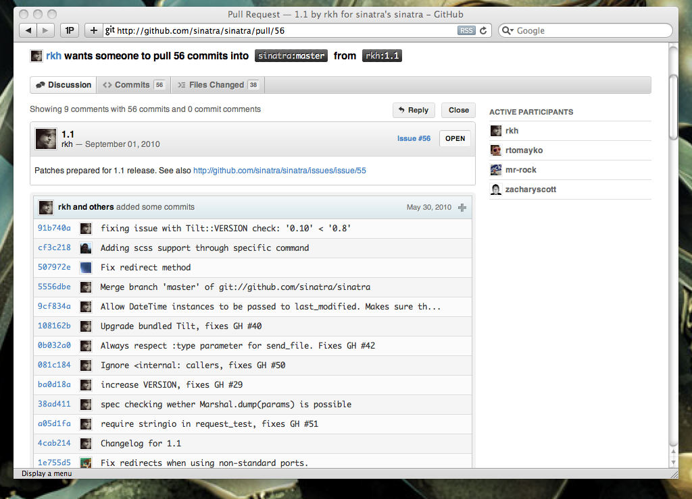

!SLIDE
# What is Git?

!SLIDE

!SLIDE

!SLIDE bullets incremental
# A Key/Value store!

* Key = SHA
* Value = Commit, Directory Tree, File, etc

!SLIDE commandline incremental
# Internals

    $ ls .git/objects/*
    .git/objects/03:
    8aa66f94c2ce5a244d465935e91cb58d723724

    .git/objects/0a:
    25d7fa6d7ef8321e0af1d7baffc9cec8b680ab

    $ git cat-file -p 038aa66f94c2ce5a244d465935e91cb58d723724
    tree 71391b82d04a137b688ec0b574e05fd8ab843e15
    author rick <technoweenie@gmail.com> 1283565228 -0700
    committer rick <technoweenie@gmail.com> 1283565228 -0700

    rdd

!SLIDE
# Distributed

* Set up remotes
* Push/Pull References
* Resolve conflicts

!SLIDE commandline incremental
# Git References

    $ cat .git/refs/heads/master  
    39e1924cbcf9a59a174d6f13606472a33e4a3f0f

    $ git cat-file -p 39e1924cbcf9a59a174d6f13606472a33e4a3f0f
    tree e130afff21b6b084e3f39be0888c614965e3eb07
    parent 038aa66f94c2ce5a244d465935e91cb58d723724
    author rick <technoweenie@gmail.com> 1284509029 -0700
    committer rick <technoweenie@gmail.com> 1284509044 -0700

    vendor redis-node