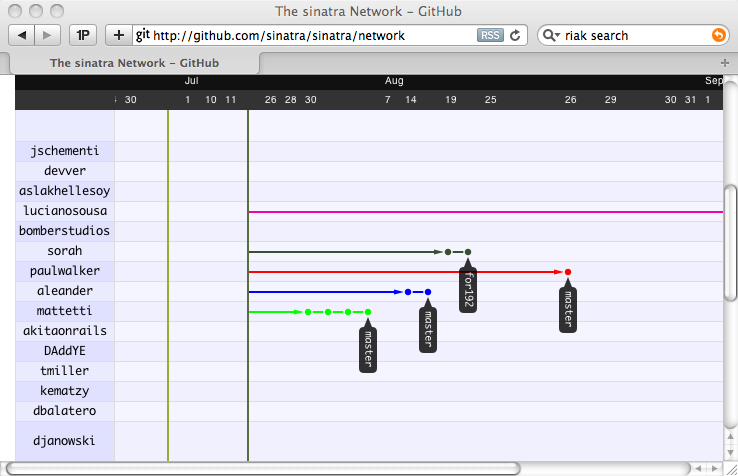
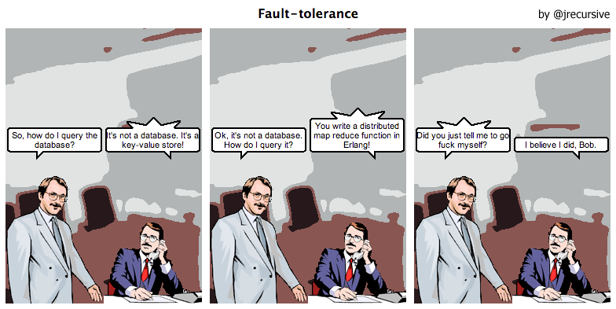
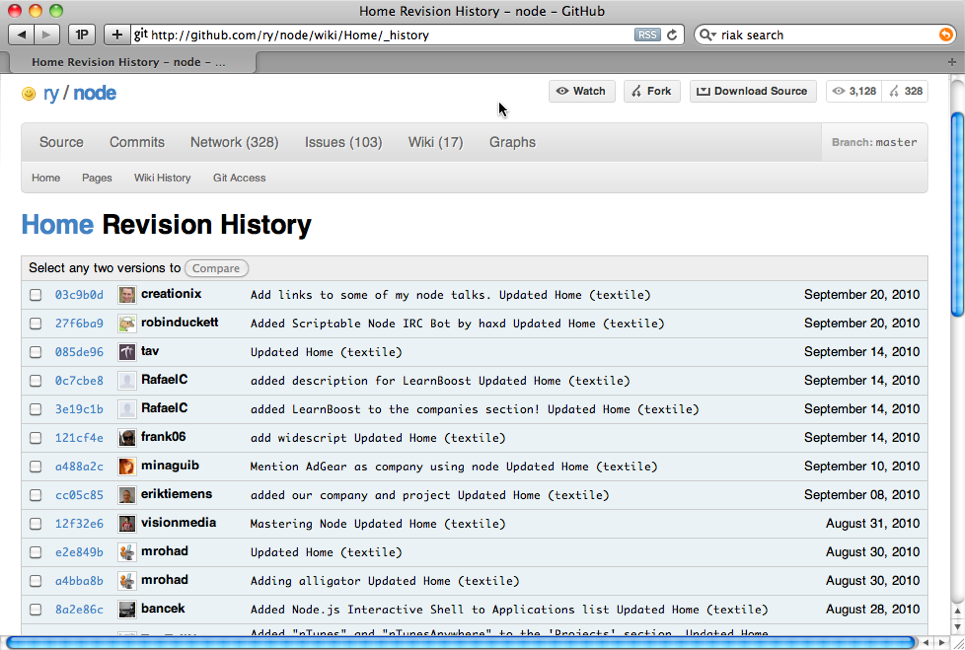
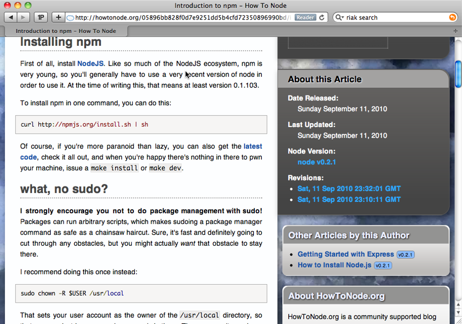

!SLIDE
# Git and Riak 

!SLIDE bullets

# Core Langauge
* Riak is written in Erlang
* Git is written in C

!SLIDE bullets
# Content Type Agnostic

* Riak values can be anything
* Git _Blobs_ can be anything

!SLIDE bullets
# Riak: API

* [HTTP](https://wiki.basho.com/display/RIAK/REST+API)
* [Protocol Buffers](https://wiki.basho.com/display/RIAK/PBC+API)

!SLIDE bullets
# Git: API

* Extensive set of console commands.
* [libgit2](http://github.com/libgit2)

!SLIDE center
# Riak: Web Scale

!SLIDE center
# Git: OSS Project Scale

!SLIDE center
# Riak: Replication

!SLIDE center
# Git: Lone Hacker

!SLIDE
# Git: Making Friends

!SLIDE commandline
# Riak: Getting a Value

    $ curl http://127.0.0.1:8098/riak/my-bucket/my-key
    {"data":[1,2,3]}

!SLIDE commandline incremental
# Git: Getting a Value

    $ git rev-parse master
    3e99e3e55610404b987b0482f8f844eddff98f7b

    $ git cat-file -p 3e99e3e55610404b987b0482f8f844eddff98f7b
    tree ba3f6333228e8f76ed375bd1e9f70635608ef78a
    parent 4c2257a01dfe432b0087c203874ab4be6019f20e
    author rick <technoweenie@gmail.com> 1284420213 -0700
    committer rick <technoweenie@gmail.com> 1284420213 -070

    $ git cat-file -p ba3f6333228e8f76ed375bd1e9f70635608ef78a
    100644 blob 6a003e5ee88ae4a5b03d34529c2ee69b364b12a1	AboutStacks.pdf
    100644 blob 4fa287fe65d2fbd08ae48391495eead0d5430ff7	Home.md
    040000 tree d69a8aaf94576b718cb5ca8e6fcdf3418e1e12bb	images
    100644 blob 5e40c0877058c504203932e5136051cf3cd3519b	rock-out.md

    $ git cat-file -p 5e40c0877058c504203932e5136051cf3cd3519b
    boom

!SLIDE commandline
# Riak: Storing a Value

    $ curl http://127.0.0.1:8091/riak/my-bucket/my-key \
        -H "Content-Type: application/json" -d '{...}'

!SLIDE commandline
# Git: Storing a Value (Part 1)

    $ git hash-object -w my-key.json
    1f7a7a472abf3dd9643fd615f6da379c4acb3e3a

!SLIDE center

!SLIDE commandline incremental
# Git: Storing a Value (Part 2)

    $ git update-index --add --cacheinfo 100644 \
      1f7a7a472abf3dd9643fd615f6da379c4acb3e3a my-key.json

    $ git write-tree
    d8329fc1cc938780ffdd9f94e0d364e0ea74f579

!SLIDE center

!SLIDE commandline incremental
# Git: Storing a Value (Part 3)

    $ echo 'storing some json' | git commit-tree d8329f
    fdf4fc3344e67ab068f836878b6c4951e3b15f3d

!SLIDE center

!SLIDE center
# Git: Object Linking

!SLIDE
# Riak: Object Linking

## Arbitrary Linking

!SLIDE bullets
# Git: Backend

* Takes full advantage of the file system

!SLIDE bullets
# Riak: Backend

* Supports swappable backends.
* Bitcask (default)
* Innodb
* DETS, ETS
* Cache (in-memory, LRU expiry)

!SLIDE commandline
# Git already has search ;)

    $ git grep Net::HTTP
    lib/faraday/adapter/net_http.rb: Net::HTTP::Proxy(proxy[:uri].host, proxy[:uri].port, proxy[:user], proxy[:password])
    lib/faraday/adapter/net_http.rb: Net::HTTP

!SLIDE center
# Riak has Map/Reduce

!SLIDE
# Who Uses Git like this?

!SLIDE center

# [Gollum](http://github.com/github/gollum)

!SLIDE center

# [Wheat](http://github.com/creationix/wheat)

!SLIDE center
# Git to Riak: "Let's be friends"

!SLIDE 

# Load Git data into Riak

    @@@ ruby
    repo = Grit::Repo.new '../faraday'
    # Load Git commits
    commits = repo.log

    ref = ref_bucket.new('master')
    ref.data = {:name => 'master', :full => 'refs/heads/master'}

    ref.links << commit_bucket.new(commits[0].id).
      to_link('commit')
    ref.store

!SLIDE 

# Load Git data into Riak

    @@@ ruby
    repo = Grit::Repo.new '../faraday'

    commits = repo.log
    # Add a record for the master branch
    ref = ref_bucket.new('master')
    ref.data = {:name => 'master', :full => 'refs/heads/master'}

    ref.links << commit_bucket.new(commits[0].id).
      to_link('commit')
    ref.store

!SLIDE 

# Load Git data into Riak

    @@@ ruby
    repo = Grit::Repo.new '../faraday'

    commits = repo.log

    ref = ref_bucket.new('master')
    ref.data = {:name => 'master', :full => 'refs/heads/master'}
    # Add the first commit as a link to master
    ref.links << commit_bucket.new(commits[0].id).
      to_link('commit')
    ref.store

!SLIDE commandline

# Read it from Riak

    $ curl /riak/refs/master -i
    HTTP/1.1 200 OK
    X-Riak-Vclock: a85hYGBgzGDKBVIsPHPL/DKYEhnzWBmeZQoc48sCAA==
    Vary: Accept-Encoding
    Server: MochiWeb/1.1 WebMachine/1.7.1 (participate in the frantic)
    Link: </riak/commits/e0fa90659a82239888da41c8f7b982b755a2d32d>; riaktag="commit", </riak/refs>; rel="up"
    Last-Modified: Fri, 24 Sep 2010 00:16:38 GMT
    ETag: yqL8V7Jsqcc0AW3dPlCYv
    Date: Fri, 24 Sep 2010 00:40:43 GMT
    Content-Type: application/json
    Content-Length: 44

    {"name":"master","full":"refs/heads/master"}

!SLIDE 

# Load commits into Riak

    @@@ ruby
    commits.each_with_index do |commit, idx|
      # Set the commit data
      commit_obj      = commit_bucket.new(commit.id)
      commit_obj.data = commit.to_hash

      commit.parents.each do |parent|
        obj = commit_bucket.new(parent.id)
        commit_obj.links << obj.to_link('parent')
      end

      commit_obj.store
    end

!SLIDE 

# Load commits into Riak

    @@@ ruby
    commits.each_with_index do |commit, idx|

      commit_obj      = commit_bucket.new(commit.id)
      commit_obj.data = commit.to_hash
      # Link to parent commits
      commit.parents.each do |parent|
        obj = commit_bucket.new(parent.id)
        commit_obj.links << obj.to_link('parent')
      end

      commit_obj.store
    end

!SLIDE commandline

# Read a commit from Riak

    $ curl /riak/commits/e0fa90659a82239888da41c8f7b982b755a2d32d -i                                                                                                    
    HTTP/1.1 200 OK
    X-Riak-Vclock: a85hYGBgzGDKBVIsPHPL/DKYEhnzWBmeZQoc48sCAA==
    Vary: Accept-Encoding
    Server: MochiWeb/1.1 WebMachine/1.7.1 (participate in the frantic)
    Link: </riak/commits/c1fdbe3e02feaf00bde700ddf9fe2b7ed8ad2fb0>; riaktag="parent", </riak/commits>; rel="up"
    Last-Modified: Fri, 24 Sep 2010 00:16:38 GMT
    ETag: yqL8V7Jsqcc0AW3dPlCYv
    Date: Fri, 24 Sep 2010 00:43:10 GMT
    Content-Type: application/json
    Content-Length: 407

    {"author":{"name":"rick","email":"technoweenie@gmail.com"},"parents":[{"id":"c1fdbe3e02feaf00bde700ddf9fe2b7ed8ad2fb0"}],"id":"e0fa90659a82239888da41c8f7b982b755a2d32d","committed_date":"2010-09-07T15:13:23-07:00","authored_date":"2010-09-07T15:13:23-07:00","message":"really really like parens","committer":{"name":"rick","email":"technoweenie@gmail.com"},"tree":"56729759fc58f231af4a85e13c3ae9e224429787"}

!SLIDE commandline

# Riak: Link Walking

    $ curl /riak/refs/master/_,commit,_
    X-Riak-Vclock: a85hYGBgzGDKBVIsPHPL/DKYEhnzWBmeZQoc48sCAA==
    Location: /riak/commits/e0fa90659a82239888da41c8f7b982b755a2d32d
    Content-Type: application/json
    Link: </riak/commits>; rel="up",
      </riak/commits/c1fdbe3e02feaf00bde700ddf9fe2b7ed8ad2fb0>; 
        riaktag="parent", 
    Etag: yqL8V7Jsqcc0AW3dPlCYv
    Last-Modified: Fri, 24 Sep 2010 00:16:38 GMT

    {"author":{"name":"rick","email":"technoweenie@gmail.com"},"parents":[{"id":"c1fdbe3e02feaf00bde700ddf9fe2b7ed8ad2fb0"}],"id":"e0fa90659a82239888da41c8f7b982b755a2d32d","committed_date":"2010-09-07T15:13:23-07:00","authored_date":"2010-09-07T15:13:23-07:00","message":"really really like parens","committer":{"name":"rick","email":"technoweenie@gmail.com"},"tree":"56729759fc58f231af4a85e13c3ae9e224429787"}

!SLIDE commandline

# Riak: Link Walking

    $ curl /riak/refs/master/_,commit,_/_,parent,_           
    X-Riak-Vclock: a85hYGBgzGDKBVIsCcUiwhlMiYx5rAz3CgSO8WUBAA==
    Location: /riak/commits/c1fdbe3e02feaf00bde700ddf9fe2b7ed8ad2fb0
    Content-Type: application/json
    Link: </riak/commits>; rel="up", </riak/commits/48cbbac37853b1a1174d5d3be5a6106b858da437>; riaktag="parent"
    Etag: 1ZePEXYffs4uSnE1KIUH8l
    Last-Modified: Fri, 24 Sep 2010 00:46:22 GMT

    {"author":{"name":"rick","email":"technoweenie@gmail.com"},"parents":[{"id":"48cbbac37853b1a1174d5d3be5a6106b858da437"}],"id":"c1fdbe3e02feaf00bde700ddf9fe2b7ed8ad2fb0","committed_date":"2010-09-07T11:38:46-07:00","authored_date":"2010-09-07T11:38:46-07:00","message":"parens are allright in my book","committer":{"name":"rick","email":"technoweenie@gmail.com"},"tree":"8b9e12913e37cdbb11bd085488714880d320e03f"}

!SLIDE commandline

# Riak: Link Walking

    $ curl /riak/refs/master/_,commit,_/_,parent,_/_,parent,_
    X-Riak-Vclock: a85hYGBgzGDKBVIsCcUiwhlMiYx5rAz3CgSO8WUBAA==
    Location: /riak/commits/48cbbac37853b1a1174d5d3be5a6106b858da437
    Content-Type: application/json
    Link: </riak/commits>; rel="up", </riak/commits/264759385f4c19a982e186f7ecf52e1f3be2049d>; riaktag="parent"
    Etag: 1ZePEXYffs4uSnE1KIUH8l
    Last-Modified: Fri, 24 Sep 2010 00:46:22 GMT

    {"author":{"name":"Eric Lindvall","email":""},"parents":[{"id":"264759385f4c19a982e186f7ecf52e1f3be2049d"}],"id":"48cbbac37853b1a1174d5d3be5a6106b858da437","committed_date":"2010-09-03T00:28:32-07:00","authored_date":"2010-09-03T00:28:32-07:00","message":"Make Connection act enough like Builder to pass a Connection in to the\nconstructor block.","committer":{"name":"Eric Lindvall","email":""},"tree":"4785505eb6fd65236142540c02152ca0e4c1becd"}
